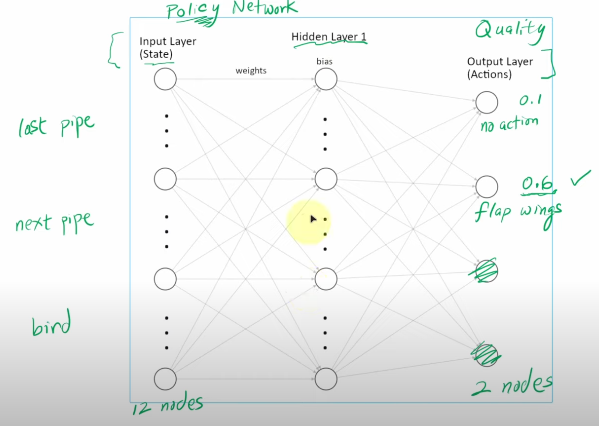

# Playing Flappy Bird automatically
## This is a project that using RL to play FlappyBird - a game of Vietnamese - automatically.
1. To install purely game:
`pip install flappy-bird-gymnasium`
2. Try with some action and reward
### Action space
` 0: do nothing`
` 1: flap`  
### Reward:
` + 0.1 - every frame it stay alive`
` + 1.0 - successfully passing a pipe`
` + -1.0 - dying`
` -0.5 - touch the top of the screen`
## Policy of nn
